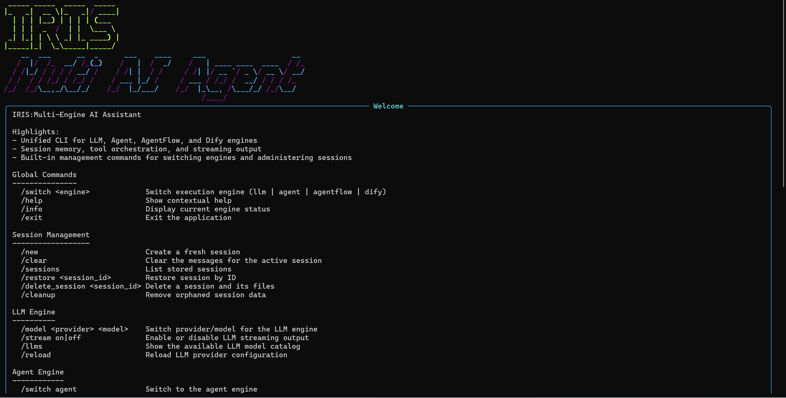

<div align="center">


# IRIS:Muti-AI-Agent

**多引擎智能体框架**

[](https://www.python.org/)
[](https://github.com/astral-sh/uv)
[](LICENSE)
[](#贡献)

基于 LangChain 与多 LLM 的中文优化智能代理框架——集成上下文记忆、多搜索引擎、高德地图、OKX 行情与 Notion 知识管理。

<br/>



</div>

---

## 快速开始

```bash
# 安装（需要 Python >= 3.10 与 uv）
uv tool install iris-muti-ai-agent

# 启动
iris

# 在 CLI 内切换引擎
/switch agent
```

首次运行会自动创建全局配置目录 `~/.iris/`（Windows: `C:\Users\<你>\.iris\`），随后在任意位置运行 `iris` 即可。完整的源码安装与编辑模式见下方「安装指南」。

---

## 功能特性

IRIS 在同一个 CLI 下提供四种运行引擎，通过 `/switch` 命令动态切换。

<table>
<tr>
<td width="50%" valign="top">

### LLM 引擎

纯对话模式，快速响应，支持流式输出。适合快速问答、创意写作、代码生成。

</td>
<td width="50%" valign="top">

### Agent 引擎

智能体模式，支持工具调用与复杂推理。含 **Basic**（常规工具调用）与 **Deep**（任务规划、子代理协作、文件系统操作）两种子模式。

</td>
</tr>
<tr>
<td width="50%" valign="top">

### AgentFlow 引擎

多智能体工作流编排，面向复杂工作流与多 Agent 协作。*（开发中）*

</td>
<td width="50%" valign="top">

### Dify 引擎

云端 AI 平台，支持文件上传、多模态理解与流式对话。适合文档分析与图片识别。

</td>
</tr>
</table>

**核心能力**

- **多 LLM 提供商**——智谱 AI、OpenAI、通义千问、Ollama 本地模型，支持动态热切换
- **DeepAgents 类型**——研究型（research）、编程型（coding）、分析型（analysis）
- **全局记忆系统**——统一记忆管理，支持会话隔离与持久化
- **灵活配置系统**——JSON 配置 + 环境变量，支持 `/reload` 热重载
- **中文优化**——针对中文场景优化的提示词与交互体验
- **智能降级**——自动降级到备用方案，保证服务可用性

**工具生态**

| 类别 | 内容 |
|------|------|
| **MCP 工具** | Model Context Protocol 扩展（文件系统、网页获取、Notion 等） |
| **Connector 工具** | 外部服务连接器（Crawl4AI 智能爬虫等） |
| **SDK 工具** | 数学计算、Tavily 搜索、高德地图、OKX 加密货币行情 |

---

## 工作模式

| 引擎 | 说明 | 适用场景 |
|------|------|----------|
| **LLM** | 纯对话模式，支持流式输出 | 快速问答、创意写作、代码生成 |
| **Agent** | 智能体模式，支持 Basic / Deep 两种子模式 | 工具调用、任务规划、子代理协作 |
| **AgentFlow** | 多智能体工作流编排（开发中） | 复杂工作流、多 Agent 协作 |
| **Dify** | 云端 AI 平台，支持文件上传和多模态 | 文档分析、图片识别 |

---

## 支持的模型

在 LLM 引擎与 Agent 引擎下，通过 `/model <provider> [model]` 动态切换。

| Provider | 模型 | 说明 |
|----------|------|------|
| **智谱 AI** | `glm-4.7-flash` ⭐ | 免费、128K 上下文、默认推荐 |
| | `glm-4.7` | 高性能思考模型 |
| | `glm-4-plus` | 综合能力强 |
| **OpenAI** | `gpt-4o-mini` ⭐ | 轻量高性价比 |
| | `gpt-4o` | 通用旗舰 |
| | `gpt-5` / `gpt-5-mini` | 最新推理模型，温度固定（1.0） |
| **通义千问** | `qwen3-max` ⭐ | 全能旗舰 |
| | `qwen3-coder-plus` | 代码优化 |
| **Ollama** | `qwen3:8b` | 本地部署、离线运行 |

```bash
/model zhipu glm-4.7-flash   # 智谱 AI 免费版（默认）
/model openai gpt-4o-mini    # OpenAI 轻量版
/model tongyi qwen3-max      # 通义千问
/model ollama qwen3:8b       # 本地模型
```

> 使用 `/llms` 查看所有可用模型，配置详见 `config/llm/providers.json`。

---

## 命令与交互

启动后输入 `/help` 查看所有可用命令。支持 **Tab 自动补全**——输入 `/` 后按 Tab 即可浏览当前引擎可用的命令及参数。

---

## 安装指南

<details>
<summary><b>从源码安装（开发 / 编辑模式）</b></summary>

<br/>

确保 Python 版本 >= 3.10，并已安装 [uv](https://github.com/astral-sh/uv) 包管理器。

**1. 克隆并同步依赖**

```bash
git clone <your-repo-url>
cd Multi-AI-Agent
uv sync
```

**2. 打包安装**

使用 uv 工具安装后，可在项目根目录直接运行 `iris` 命令。

- 品牌名称：`IRIS:muti-ai-agent`
- Python 分发包名：`iris-muti-ai-agent`（用于 `uv tool` 安装管理）

```powershell
# Windows PowerShell
.venv\Scripts\activate
uv tool uninstall muti-ai-agent 2>$null
uv tool uninstall iris-muti-ai-agent 2>$null
uv tool install --python .venv\Scripts\python.exe --editable --force --reinstall --refresh --no-cache .
```

```bash
# Linux / Mac
source .venv/bin/activate
uv tool uninstall muti-ai-agent || true
uv tool uninstall iris-muti-ai-agent || true
uv tool install --python .venv/bin/python --editable --force --reinstall --refresh --no-cache .
```

**3. 更新程序**

修改代码后，重新打包安装即可：

```powershell
# Windows PowerShell
uv tool install --python .venv\Scripts\python.exe --editable --force --reinstall --refresh --no-cache .
```

```bash
# Linux / Mac
uv tool install --python .venv/bin/python --editable --force --reinstall --refresh --no-cache .
```

</details>

<details>
<summary><b>配置 API 密钥</b></summary>

<br/>

首次运行会自动创建 `~/.iris/` 全局配置目录（Windows: `C:\Users\<你>\.iris\`）。

**支持的 API 服务**

1. **智谱 AI** —— [智谱 AI 开放平台](https://open.bigmodel.cn/)（必需）
2. **OpenAI** —— [OpenAI API](https://platform.openai.com/)（可选）
3. **Ollama 本地模型** —— [Ollama](https://ollama.com/)（可选，支持本地离线运行）
4. **Tavily 搜索** —— [Tavily](https://tavily.com/)（推荐）
5. **高德地图** —— [高德地图开放平台](https://lbs.amap.com/dev/key/app)（推荐）
6. **Notion** —— [Notion API](https://developers.notion.com/)（可选）

**创建配置文件**

```powershell
# Windows PowerShell
cd $env:USERPROFILE\.iris
Copy-Item .env.example .env -Force
notepad .env
```

```bash
# Linux / Mac
cd ~/.iris
cp .env.example .env
nano .env
```

**`.env` 配置示例**

```env
# 必需 - 至少配置一个 LLM
ZHIPU_API_KEY=your_zhipu_api_key_here
OPENAI_API_KEY=your_openai_api_key_here

# Ollama 本地模型（可选）
OLLAMA_BASE_URL=http://localhost:11434

# 推荐 - 搜索和地图功能
TAVILY_API_KEY=your_tavily_api_key_here
AMAP_API_KEY=your_amap_api_key_here

# Dify 云端 AI 平台（可选）
DIFY_API_KEY=your_dify_api_key_here

# 可选 - Notion 知识管理
NOTION_TOKEN=your_notion_integration_token_here

# LLM 配置
DEFAULT_LLM_PROVIDER=zhipu
DEFAULT_LLM_MODEL=glm-4.7-flash
```

</details>

<details>
<summary><b>启动 Crawl4AI Connector 服务（Docker）</b></summary>

<br/>

项目根目录已提供 `docker-compose.yml`，可直接启动：

```powershell
# Windows PowerShell
docker compose up -d crawl4ai          # 启动服务
docker compose ps crawl4ai             # 查看状态
docker compose logs --tail 100 crawl4ai # 查看日志
Invoke-WebRequest http://localhost:11235/health  # 健康检查
```

```bash
# Linux / Mac
docker compose up -d crawl4ai          # 启动服务
docker compose ps crawl4ai             # 查看状态
docker compose logs --tail 100 crawl4ai # 查看日志
curl http://localhost:11235/health     # 健康检查
```

服务启动后可在 CLI 中验证：

```text
/connector status
/connector tools
```

</details>

---

## 配置说明

<details>
<summary><b>配置优先级与目录结构</b></summary>

<br/>

**配置优先级**（从高到低）

1. **当前目录 `.env` 文件** —— 项目特定的环境变量和 API 密钥
2. **项目级配置**（`<project>/.iris/`）—— 项目特定的配置文件和设置
3. **用户级配置**（`~/.iris/`）—— 全局用户配置，所有项目共享
4. **内置默认配置** —— 打包在程序中的默认配置（兜底）

**配置目录结构**

```
~/.iris/
├── .env              # 全局 API 密钥配置
├── .env.example      # 配置模板
├── config.toml       # 全局配置文件
├── llm/              # LLM 模型配置
├── agents/           # Agent 配置
├── tools/            # 工具配置
└── sessions/         # 会话数据
```

项目级配置（可选）：在项目根目录创建 `.iris/` 目录可覆盖全局配置。

</details>

<details>
<summary><b>核心配置项</b></summary>

<br/>

| 配置项 | 说明 | 示例 | 必需 |
|--------|------|------|------|
| `ZHIPU_API_KEY` | 智谱 AI API 密钥 | `abcd1234.efgh5678...` | 二选一 |
| `OPENAI_API_KEY` | OpenAI API 密钥 | `sk-xxxxxxxx...` | 二选一 |
| `OLLAMA_BASE_URL` | Ollama 服务地址 | `http://localhost:11434` | 否 |
| `DEFAULT_LLM_PROVIDER` | 默认提供商 | `zhipu` / `openai` / `ollama` | 否 |
| `DEFAULT_LLM_MODEL` | 默认模型 | `glm-4.7-flash` / `gpt-4o-mini` | 否 |
| `DIFY_API_KEY` | Dify 云端 API 密钥 | `app-xxxxxxxx...` | 否 |
| `TAVILY_API_KEY` | Tavily 搜索 API 密钥 | `tvly-xxxxxxxx...` | 推荐 |
| `AMAP_API_KEY` | 高德地图 API 密钥 | `xxxxxxxx...` | 推荐 |
| `NOTION_TOKEN` | Notion 集成 Token | `ntn_xxxxxxxx...` | 否 |

</details>

<details>
<summary><b>高级配置</b></summary>

<br/>

**LLM 模型配置** —— `~/.iris/llm/models/providers.json`（或项目级 `.iris/llm/models/providers.json`）

- `mode_overrides`：针对不同模式设置不同参数
- 温度固定：部分模型（如 GPT-5）温度参数固定，无法通过配置修改
- `supports_tools`：控制模型是否启用工具调用

**DeepAgent 配置** —— `~/.iris/agents/deep/models/`（或项目级 `.iris/agents/deep/models/`）

- 主代理配置：`mainagents.json`
- 子代理配置：`subagents.json`
- 中间件配置：`middleware/` 目录

**配置覆盖策略**

- **全局配置**：修改 `~/.iris/` 下的配置文件，影响所有项目
- **项目配置**：在项目根目录创建 `.iris/` 并放置配置文件，仅影响当前项目
- **临时配置**：在当前目录创建 `.env` 文件，覆盖环境变量

</details>

> **配置热重载**：修改配置文件后，使用 `/reload` 命令即可生效，无需重启程序。

详细安装说明见 [IRIS_SETUP.md](IRIS_SETUP.md)。

---

## 贡献

欢迎提交 Issue 与 Pull Request。完整更新历史请查看 [CHANGELOG.md](CHANGELOG.md)。

## 许可证

本项目基于 [MIT License](LICENSE) 开源。

<div align="center">
<sub>IRIS · Multi-AI-Agent</sub>
</div>
