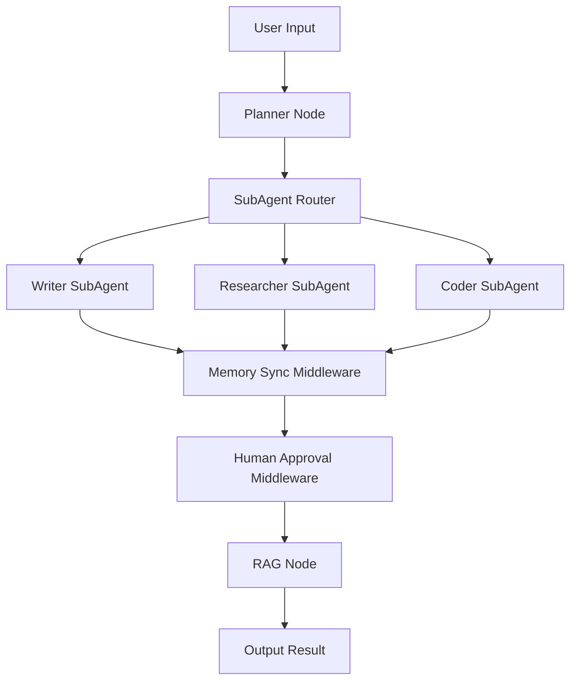

# 🧭 Multi-AI-Agent 架构规划（LangGraph + DeepAgents）

> 版本：v3.0.0
> 
> 
> **目标**：基于 LangGraph 工作流框架 + DeepAgents 自主智能体体系，构建一个可扩展的多智能体系统。
> 
> **作者**：diverHansun
> 

---

## 🌐 一、总体架构概览

```
src/
├── components/
│   └── langgraph/
│       ├── core_nodes/          # 基础节点（Tool、RAG、Memory、Router...）
│       └── graph_builder.py     # Graph 构建器
│
├── agents/
│   └── langgraph/
│       ├── base_agent.py
│       ├── deepagents/
│       │   ├── deep_agent_graph.py       # DeepAgent 主执行图
│       │   ├── planner_node.py
│       │   ├── subagent_router.py
│       │   ├── middleware/
│       │   │   ├── logging_middleware.py
│       │   │   ├── retry_middleware.py
│       │   │   ├── human_approval.py
│       │   │   └── memory_sync.py
│       │   └── subagents/
│       │       ├── writer_agent_graph.py
│       │       ├── researcher_agent_graph.py
│       │       └── coder_agent_graph.py
│       └── agent_registry.py

```

---

## 🧩 二、系统设计理念

整个项目基于三个核心层次：

| 层级 | 名称 | 职责 |
| --- | --- | --- |
| **1️⃣ LangGraph Core 层** | Workflow Runtime | 提供节点执行机制、状态流转、图构建接口 |
| **2️⃣ LangGraph Agent 层** | Agent 构建层 | 组合节点形成可执行 Agent Graph（包括 DeepAgents） |
| **3️⃣ DeepAgent 层** | 自主智能体层 | 实现具备规划、反思、子 Agent 调度与中间件支持的自主智能体 |

LangGraph 作为工作流引擎（workflow runtime），提供图式化执行控制；

DeepAgents 作为上层智能体封装，基于 LangGraph 架构实现多层协作与自主任务规划。

---

## ⚙️ 三、components/langgraph/ 模块

### 📁 `components/langgraph/core_nodes/`

定义系统运行的基础节点类型，供所有 Agent（包括 DeepAgent）调用复用。

| 文件 | 说明 |
| --- | --- |
| **tool_node.py** | 外部工具调用节点（可连接 MCP 工具或本地工具） |
| **rag_node.py** | 知识检索节点，连接向量数据库或 Embedding 模块 |
| **memory_node.py** | 状态持久化与记忆节点（短期 + 长期） |
| **router_node.py** | 条件路由节点，用于智能选择下一个执行节点 |
| **control_node.py** | 执行控制节点，可实现暂停、终止或 human-in-loop |
| **checkpoint_node.py** | 状态快照与恢复节点，用于容错与回溯 |

> 💡 这些节点是「通用工作流组件」，
> 
> 
> 可被 LangGraph workflow、普通 Agent Graph、DeepAgent 共同使用。
> 

---

### ⚙️ `graph_builder.py`

统一的图构建与编译入口，封装了 LangGraph 的 `StateGraph` 构建逻辑。

### 功能要点

- 统一节点注册机制；
- 自动添加输入输出节点；
- 支持条件边（Conditional Edge）与分支；
- 支持从配置文件动态加载节点结构。

### 示例

```python
from langgraph.graph import StateGraph
from components.langgraph.core_nodes import tool_node, memory_node, rag_node

def build_basic_graph():
    graph = StateGraph()
    graph.add_node("tool", tool_node)
    graph.add_node("memory", memory_node)
    graph.add_node("rag", rag_node)
    graph.add_edge("tool", "memory")
    graph.add_edge("memory", "rag")
    graph.set_entry("tool")
    return graph.compile()

```

---

## 🤖 四、agents/langgraph/ 模块

### 📁 `base_agent.py`

定义所有 LangGraph Agent 的通用抽象接口。

### 核心职责

- 初始化 graph；
- 注册节点；
- 控制执行入口（sync/async）；
- 提供可插拔的中间件。

---

### 📁 `deepagents/`

DeepAgents 是系统的“自主智能体”层，负责执行更复杂、多步、自反性任务。

### 🧠 DeepAgents 特性

- 自动规划（Planner）；
- 子 Agent 调度（SubAgent Router）；
- 自我记忆同步（Memory Sync）；
- 可插拔中间件（Middleware）；
- 支持人类审查（Human Approval）；
- 多模型 Provider 路由（vLLM / Zhipu / OpenAI）。

---

### 📄 `deep_agent_graph.py`

DeepAgent 的主执行图，负责协调 Planner、Router、Memory、RAG 等节点。

### 结构示例

```python
from langgraph.graph import StateGraph
from agents.langgraph.deepagents.planner_node import planner_node
from agents.langgraph.deepagents.subagent_router import subagent_router
from components.langgraph.core_nodes import memory_node, rag_node, control_node

def build_deep_agent_graph():
    graph = StateGraph()
    graph.add_node("planner", planner_node)
    graph.add_node("router", subagent_router)
    graph.add_node("memory", memory_node)
    graph.add_node("rag", rag_node)
    graph.add_node("control", control_node)
    graph.add_edge("planner", "router")
    graph.add_edge("router", "memory")
    graph.add_edge("memory", "rag")
    graph.add_edge("rag", "control")
    graph.set_entry("planner")
    return graph.compile()

```

---

### 📄 `planner_node.py`

负责任务分析与规划，将用户输入拆解为多步子任务。

### 示例

```python
from langgraph.types import Command

def planner_node(state):
    query = state.get("task", "")
    plan = f"Step1: 理解任务 → Step2: 搜集信息 → Step3: 生成结果"
    return Command(update={"plan": plan, "messages": [f"规划结果: {plan}"]})

```

---

### 📄 `subagent_router.py`

根据任务类型或计划内容，动态调用不同子 Agent（Writer / Researcher / Coder）。

### 示例

```python
from agents.langgraph.deepagents.subagents import (
    writer_agent_graph, researcher_agent_graph, coder_agent_graph
)

def subagent_router(state):
    plan = state.get("plan", "")
    if "写作" in plan:
        return writer_agent_graph.run(state)
    elif "研究" in plan:
        return researcher_agent_graph.run(state)
    else:
        return coder_agent_graph.run(state)

```

---

### 📁 `middleware/`

中间件用于在 DeepAgent 执行前后插入系统逻辑，如日志、错误重试、人类审批等。

| 文件 | 功能 |
| --- | --- |
| **logging_middleware.py** | 记录执行日志与节点流转信息 |
| **retry_middleware.py** | 异常时自动重试机制 |
| **human_approval.py** | 暂停执行并等待人类批准 |
| **memory_sync.py** | 在 DeepAgent 与全局记忆之间同步数据 |

---

### 📁 `subagents/`

定义可复用的子智能体，每个子智能体本身也是一个 LangGraph。

| 文件 | 功能 |
| --- | --- |
| **writer_agent_graph.py** | 处理写作任务（文章、报告、摘要） |
| **researcher_agent_graph.py** | 处理调研任务（搜索、资料整理） |
| **coder_agent_graph.py** | 处理代码任务（解释、生成、调试） |

---

### 📄 `agent_registry.py`

全局 Agent 注册中心。

用于动态加载、索引与统一调度不同 Agent Graph。

### 示例

```python
from agents.langgraph.deepagents.deep_agent_graph import build_deep_agent_graph

AGENT_REGISTRY = {
    "deepagent": build_deep_agent_graph(),
    "writer": "agents.langgraph.deepagents.subagents.writer_agent_graph",
    "researcher": "agents.langgraph.deepagents.subagents.researcher_agent_graph",
    "coder": "agents.langgraph.deepagents.subagents.coder_agent_graph",
}

```

---

## 🧠 五、DeepAgents 运行逻辑

### 🔁 执行循环（简化版）



DeepAgent 的运行可在 CLI 或 FastAPI 中触发，

支持同步（普通执行）与异步（后台持续）两种模式。

---

## 🔧 六、开发建议与扩展方向

| 方向 | 建议 |
| --- | --- |
| **节点扩展** | 新增如 `DataAnalysisNode`、`VisionNode` 等特殊节点 |
| **中间件增强** | 加入 `RateLimiter`、`Telemetry`、`Profiler` |
| **跨模型协作** | 在 `subagent_router` 中支持模型级动态路由 |
| **API 集成** | 暴露 DeepAgent Graph 为 `/api/deepagent/run` 接口 |
| **任务持久化** | 引入 Redis 或 SQLite 存储执行日志与状态快照 |
| **图可视化** | 使用 `LangGraph Studio` 查看节点流转情况 |

---

## ✅ 七、总结

| 模块 | 职责 | 特点 |
| --- | --- | --- |
| **LangGraph Core** | 节点与图的基础机制 | workflow runtime |
| **LangGraph Agent** | 构建任务导向型 Agent Graph | 结构化逻辑流 |
| **DeepAgents** | 自主智能体层，具备规划与反思能力 | 高级智能行为 |
| **Middleware** | 管理 Agent 执行过程中的横切逻辑 | 日志、重试、人审等 |
| **SubAgents** | 任务级复用智能体 | 可独立或协作运行 |

> 🔹 LangGraph = Workflow 引擎
> 
> 
> 🔹 **DeepAgents = 自主智能体封装**
> 
> 🔹 **二者结合 = 可组合、可反思、可复用的多智能体系统**
>