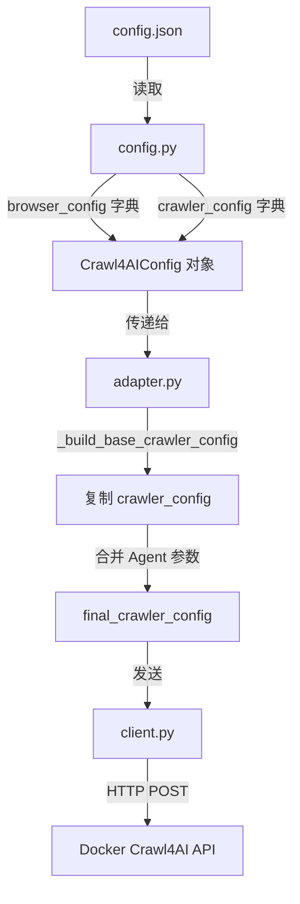

# Crawl4AI 参数传递修复文档

## 📋 问题概述

在重构 Crawl4AI 配置结构后(将 `"crawl"` 改为 `"crawler"` 字段),参数传递出现断层,导致用户在 `config.json` 中配置的参数无法正确传递到 Docker 中的 Crawl4AI 服务。

### 问题表现
- Agent 调用 crawl4ai 工具时,配置文件中的参数不生效
- 只能通过代码中直接传递参数才能工作
- 配置文件的设计初衷(集中管理爬取参数)未能实现

---

## 🔍 问题根源分析

### 对比:工作版本 vs 问题版本

#### **工作版本** (commit 1613b0c)
```
config.json ("crawl" 字段)
    ↓
config.py (逐个属性读取,如 self.word_count_threshold)
    ↓
adapter.py (_build_base_crawler_config 逐个构建字典)
    ↓
client.py (发送到 Docker API)
```

**config.json 结构:**
```json
{
  "default": { ... },
  "crawl": {
    "word_count_threshold": 200,
    "only_text": true,
    ...
  }
}
```

**config.py 逻辑:**
```python
crawl_config = config_data.get("crawl", {})
self.word_count_threshold = crawl_config.get("word_count_threshold", 200)
self.only_text = crawl_config.get("only_text", True)
# ... 逐个设置属性
```

**adapter.py 逻辑:**
```python
def _build_base_crawler_config(self, config):
    return {
        "word_count_threshold": config.word_count_threshold,
        "only_text": config.only_text,
        # ... 逐个从 config 对象读取
    }
```

#### **问题版本** (重构后)
```
config.json ("crawler" 字段)
    ↓
config.py (读取为 self.crawler_config 字典 + 重复设置属性)
    ↓
adapter.py (直接返回 config.crawler_config)  ❌ 参数断层
    ↓
client.py (发送到 Docker API)
```

**config.json 结构:**
```json
{
  "default": { ... },
  "browser": { ... },
  "crawler": {
    "word_count_threshold": 200,
    "only_text": false,
    ...
  }
}
```

**config.py 问题逻辑:**
```python
# 读取为字典
self.crawler_config = config_data.get("crawler", {})

# 又重复设置为属性(冗余)
self.word_count_threshold = self.crawler_config.get("word_count_threshold")
self.only_text = self.crawler_config.get("only_text")
# ...
```

**adapter.py 问题逻辑:**
```python
def _build_base_crawler_config(self, config):
    # 直接获取字典,但没有正确返回
    base_crawler_config = getattr(config, 'crawler_config', {})
    return base_crawler_config  # ❌ 可能返回空字典或引用问题
```

### 问题关键点

1. **重复冗余**: config.py 既设置了字典又设置了属性
2. **传递断层**: adapter.py 没有正确处理字典的复制和传递
3. **逻辑不一致**: 失去了工作版本中清晰的参数流转路径

---

## ✅ 修复方案

### 核心思路
保持新的配置结构(`browser`/`crawler` 分离),但修复参数传递逻辑:

```
config.json (browser/crawler字段)
    ↓
config.py (读取为字典,移除冗余属性)
    ↓
adapter.py (正确复制字典并传递)
    ↓
client.py (发送到 Docker API)
```

### 具体修改

#### 1. **修改 config.py** (`src/tools/connector/crawl4ai/config.py:48-64`)

**修改前:**
```python
# 设置字典
self.browser_config = config_data.get("browser", {})
self.crawler_config = config_data.get("crawler", {})

# 冗余:又设置具体属性
self.word_count_threshold = self.crawler_config.get("word_count_threshold")
self.only_text = self.crawler_config.get("only_text")
self.css_selector = self.crawler_config.get("css_selector")
# ... 30+ 个属性
```

**修改后:**
```python
# 只设置字典,移除冗余属性
self.browser_config: Dict = config_data.get("browser", {})
self.crawler_config: Dict = config_data.get("crawler", {})
self.http_config: Dict = config_data.get("http", {})
# ... 其他预留配置字典

# 只保留必要的独立属性
self.return_format: str = self.crawler_config.get("return_format", "markdown")
```

#### 2. **修改 adapter.py** (`src/tools/connector/crawl4ai/adapter.py:47-53`)

**修改前:**
```python
def _build_base_crawler_config(self, config):
    base_crawler_config = getattr(config, 'crawler_config', {})
    return base_crawler_config  # ❌ 可能返回空或引用
```

**修改后:**
```python
def _build_base_crawler_config(self, config):
    # 获取 crawler_config 字典
    base_crawler_config = getattr(config, 'crawler_config', {})

    # 返回副本,避免修改原始配置
    return base_crawler_config.copy() if base_crawler_config else {}
```

#### 3. **简化 Input 模型** (`src/tools/connector/crawl4ai/adapter.py:13-27`)

**修改前:**
```python
class Crawl4AICrawlInput(BaseModel):
    urls: List[str]
    word_count_threshold: Optional[int] = None
    only_text: Optional[bool] = None
    css_selector: Optional[str] = None
    # ... 50+ 个具体参数
    browser_config: Optional[Dict] = None
    crawler_config: Optional[Dict] = None
```

**修改后:**
```python
class Crawl4AICrawlInput(BaseModel):
    urls: List[str] = Field(..., description="List of URLs to crawl")

    # 只保留配置字典,移除冗余的具体参数
    browser_config: Optional[Dict] = Field(default_factory=dict, description="Browser configuration based on BrowserConfig")
    crawler_config: Optional[Dict] = Field(default_factory=dict, description="Crawler configuration based on CrawlerRunConfig")
    http_config: Optional[Dict] = Field(default_factory=dict, description="HTTP configuration (reserved)")
    # ... 其他预留配置
```

#### 4. **简化 _arun 方法** (`src/tools/connector/crawl4ai/adapter.py:66-98`)

**修改前:**
```python
async def _arun(self,
               urls: List[str],
               word_count_threshold: Optional[int] = None,
               only_text: Optional[bool] = None,
               # ... 50+ 个参数
               browser_config: Optional[Dict] = None,
               crawler_config: Optional[Dict] = None):
    # 复杂的参数合并逻辑
    kwargs = locals().copy()
    # ...
    self._apply_parameter_overrides(final_crawler_config, **kwargs)
```

**修改后:**
```python
async def _arun(self,
               urls: List[str],
               browser_config: Optional[Dict] = None,
               crawler_config: Optional[Dict] = None,
               # ... 预留配置字典
               ) -> str:
    # 简洁的参数合并逻辑
    config = self.get_config()

    # 从配置文件构建基础配置
    final_crawler_config = self._build_base_crawler_config(config)

    # 如果传入了 crawler_config 参数,合并覆盖
    if crawler_config is not None:
        final_crawler_config.update(crawler_config)

    # 浏览器配置同理
    final_browser_config = getattr(config, 'browser_config', {}).copy()
    if browser_config is not None:
        final_browser_config.update(browser_config)

    # 调用 client
    result = await client.crawl(
        urls=urls,
        browser_config=final_browser_config,
        crawler_config=final_crawler_config
    )
```

---

## 🎯 修复后的参数传递流程

### 完整的参数流转路径



### 参数优先级

1. **最低优先级**: `config.json` 中的默认配置
   ```json
   {
     "crawler": {
       "word_count_threshold": 200,
       "verbose": true
     }
   }
   ```

2. **中等优先级**: Agent 工具调用时传递 `crawler_config` 字典
   ```python
   await tool._arun(
       urls=["https://example.com"],
       crawler_config={"word_count_threshold": 100}
   )
   ```

3. **最高优先级**: 字典参数会覆盖配置文件的对应键
   ```python
   # 最终: word_count_threshold = 100, verbose = true
   final_crawler_config = {
       "word_count_threshold": 100,  # 从 Agent 参数
       "verbose": true                # 从 config.json
   }
   ```

---

## 🧪 测试验证

### 测试用例 1: 使用配置文件参数

**config.json:**
```json
{
  "crawler": {
    "word_count_threshold": 200,
    "only_text": false,
    "verbose": true
  }
}
```

**Agent 调用:**
```python
await crawl4ai_tool._arun(urls=["https://example.com"])
```

**预期结果:** ✅ 使用 config.json 中的所有参数

### 测试用例 2: 覆盖部分参数

**Agent 调用:**
```python
await crawl4ai_tool._arun(
    urls=["https://example.com"],
    crawler_config={"verbose": False, "word_count_threshold": 50}
)
```

**最终配置:**
```json
{
  "word_count_threshold": 50,    // 已覆盖
  "only_text": false,             // 来自配置文件
  "verbose": false                // 已覆盖
}
```

### 测试用例 3: 浏览器配置

**config.json:**
```json
{
  "browser": {
    "viewport_width": 1080,
    "viewport_height": 600
  }
}
```

**Agent 调用:**
```python
await crawl4ai_tool._arun(
    urls=["https://example.com"],
    browser_config={"viewport_width": 1920}
)
```

**最终浏览器配置:**
```json
{
  "viewport_width": 1920,   // 已覆盖
  "viewport_height": 600    // 来自配置文件
}
```

---

## 📊 配置类结构说明

### Crawl4AI SDK 配置类

#### 1. **BrowserConfig** - 浏览器配置
控制浏览器实例的创建和行为:

| 参数 | 类型 | 说明 | 默认值 |
|------|------|------|--------|
| `browser_type` | str | 浏览器类型 | "chromium" |
| `headless` | bool | 无头模式 | true |
| `viewport_width` | int | 视口宽度 | 1080 |
| `viewport_height` | int | 视口高度 | 600 |
| `user_agent` | str | 用户代理 | Chrome UA |
| `ignore_https_errors` | bool | 忽略HTTPS错误 | true |

#### 2. **CrawlerRunConfig** - 爬取运行配置
控制每次爬取操作的行为:

| 参数 | 类型 | 说明 | 默认值 |
|------|------|------|--------|
| `word_count_threshold` | int | 最小字数阈值 | 200 |
| `only_text` | bool | 仅提取文本 | false |
| `excluded_tags` | list | 排除的标签 | ["nav", "footer", ...] |
| `cache_mode` | str | 缓存模式 | "bypass" |
| `wait_until` | str | 等待条件 | "domcontentloaded" |
| `page_timeout` | int | 页面超时(ms) | 60000 |
| `verbose` | bool | 详细日志 | true |
| `screenshot` | bool | 截图 | false |
| `pdf` | bool | 生成PDF | false |

#### 3. **预留配置类** (未来扩展)
- `http_config` - HTTPCrawlerConfig
- `geolocation_config` - GeolocationConfig
- `proxy_config` - ProxyConfig
- `virtual_scroll_config` - VirtualScrollConfig
- `link_preview_config` - LinkPreviewConfig
- `llm_config` - LLMConfig
- `seeding_config` - SeedingConfig

---

## 🔌 Crawl4AI Docker API 端点

### 当前已实现

| 端点 | 方法 | 说明 | 实现位置 |
|------|------|------|----------|
| `/health` | GET | 健康检查 | client.py:76-82 |
| `/schema` | GET | 获取配置schema | client.py:84-86 |
| `/crawl` | POST | 同步爬取 | client.py:88-108 |
| `/crawl/stream` | POST | 流式爬取 | client.py:110-152 |

**`/crawl` 请求格式:**
```json
{
  "urls": ["https://example.com"],
  "browser_config": {
    "viewport_width": 1920,
    "viewport_height": 1080
  },
  "crawler_config": {
    "word_count_threshold": 200,
    "verbose": true
  }
}
```

### 未来可扩展端点

| 端点 | 说明 | 状态 |
|------|------|------|
| `/screenshot` | 截图专用端点 | 未实现 |
| `/pdf` | PDF生成专用端点 | 未实现 |
| `/execute_js` | JavaScript执行 | 未实现 |
| `/html` | 预处理HTML | 未实现 |
| `/metrics` | Prometheus指标 | 未实现 |

**说明:**
- `screenshot` 和 `pdf` 参数在 `/crawl` 端点中返回 base64 编码
- 专用端点 `/screenshot` 和 `/pdf` 可直接保存文件
- 未来扩展时可添加对应的 client 方法和 adapter 工具

---

## 🔄 Agent 工具集成

### 集成路径

```
src/tools/connector/crawl4ai/
    ├── __init__.py          # get_tools() 导出
    └── adapter.py           # Crawl4AICrawlTool

src/tools/connector/manager.py
    └── ConnectorToolManager  # 管理所有连接器工具

src/agents/
    ├── openai_agent.py      # ✅ 已集成
    ├── zhipu_agent.py       # ✅ 已集成
    ├── zhipu_fcall_agent.py # ✅ 已集成
    └── ollama_agent.py      # ✅ 已集成
```

### 集成代码示例

**所有 Agent 中的统一集成:**
```python
from ..tools import ConnectorToolManager

# 在工具初始化时
connector_manager = ConnectorToolManager()
connector_tools = connector_manager.get_all_tools()
self.tools.extend(connector_tools)
logger.info(f"Connector tools loaded: {len(connector_tools)} tools")
```

### 工具调用示例

**Agent 自动调用:**
```python
# Agent 会自动识别并调用 crawl4ai_crawl 工具
user_query = "请帮我爬取 https://example.com 的内容"

# Agent 内部会:
# 1. 识别需要使用 crawl4ai_crawl 工具
# 2. 构造参数: {"urls": ["https://example.com"]}
# 3. 调用工具并获取结果
# 4. 使用配置文件中的默认参数
```

**自定义参数调用:**
```python
# Agent 也可以传递自定义配置
{
    "urls": ["https://example.com"],
    "crawler_config": {
        "word_count_threshold": 50,
        "verbose": false
    }
}
```

---

## 📝 配置文件示例

### 基础配置 (config.json)

```json
{
  "default": {
    "base_url": "http://localhost:11235",
    "timeout": 60,
    "stream_timeout": 120,
    "retry_attempts": 2,
    "token": null
  },
  "browser": {
    "browser_type": "chromium",
    "headless": true,
    "browser_mode": "dedicated",
    "viewport_width": 1080,
    "viewport_height": 600,
    "user_agent": "Mozilla/5.0 (X11; Linux x86_64) AppleWebKit/537.36 Chrome/116.0.0.0 Safari/537.36",
    "ignore_https_errors": true,
    "java_script_enabled": true
  },
  "crawler": {
    "word_count_threshold": 200,
    "only_text": false,
    "excluded_tags": ["nav", "footer", "aside", "script", "style"],
    "cache_mode": "bypass",
    "wait_until": "domcontentloaded",
    "page_timeout": 60000,
    "verbose": true,
    "return_format": "markdown"
  }
}
```

### 高级配置示例

**新闻爬取配置:**
```json
{
  "crawler": {
    "word_count_threshold": 300,
    "only_text": true,
    "excluded_tags": ["nav", "footer", "aside", "script", "style", "header", "advertisement"],
    "css_selector": "article",
    "content_filter_type": "pruning",
    "pruning_threshold": 0.5,
    "prefer_fit_markdown": true
  }
}
```

**反爬虫网站配置:**
```json
{
  "browser": {
    "user_agent_mode": "random",
    "enable_stealth": true,
    "ignore_https_errors": true
  },
  "crawler": {
    "simulate_user": true,
    "wait_for_images": true,
    "delay_before_return_html": 2.0,
    "mean_delay": 1.0,
    "magic": true,
    "wait_until": "networkidle"
  }
}
```

---

## 🎯 使用建议

### 1. **配置文件 vs 代码参数**

**推荐使用配置文件当:**
- 参数在多次爬取中保持一致
- 需要集中管理爬取策略
- 团队协作需要共享配置

**推荐使用代码参数当:**
- 针对特定URL需要特殊配置
- 临时测试不同的参数组合
- 需要动态调整爬取策略

### 2. **参数优先级策略**

```python
# 场景1: 完全使用配置文件
await tool._arun(urls=["https://example.com"])

# 场景2: 覆盖个别参数
await tool._arun(
    urls=["https://example.com"],
    crawler_config={"verbose": False}  # 只覆盖 verbose
)

# 场景3: 完全自定义
await tool._arun(
    urls=["https://example.com"],
    crawler_config={
        "word_count_threshold": 50,
        "only_text": True,
        "cache_mode": "enabled"
    }
)
```

### 3. **调试建议**

**启用详细日志:**
```json
{
  "crawler": {
    "verbose": true,
    "log_console": true,
    "capture_console_messages": true
  }
}
```

**检查实际传递的参数:**
```python
# 在 adapter.py 中添加日志
logger.info(f"Final crawler config: {final_crawler_config}")
logger.info(f"Final browser config: {final_browser_config}")
```

---

## 🚀 未来扩展建议

### 1. **添加专用端点工具**

**截图工具示例:**
```python
# client.py 添加
async def screenshot(self, url: str, output_path: str, wait_for: int = 2):
    payload = {
        "url": url,
        "screenshot_wait_for": wait_for,
        "output_path": output_path
    }
    return await self._make_request("POST", "/screenshot", payload)

# adapter.py 添加
class Crawl4AIScreenshotTool(BaseTool):
    name = "crawl4ai_screenshot"
    description = "Capture full-page screenshot of a URL"

    async def _arun(self, url: str, output_path: str):
        async with Crawl4AIClient(self.config) as client:
            return await client.screenshot(url, output_path)
```

### 2. **增强配置管理**

- 添加配置验证和提示
- 支持多环境配置(dev/staging/prod)
- 配置热重载功能

### 3. **性能优化**

- 添加缓存策略配置
- 支持并发爬取控制
- 添加速率限制配置

---

## 📚 参考资料

- [Crawl4AI 官方文档](https://docs.crawl4ai.com/)
- [Crawl4AI Docker 部署](https://docs.crawl4ai.com/core/docker-deployment/)
- [项目配置示例](config/connector/crawl4ai/config_example.json)
- [项目 README](config/connector/crawl4ai/README.md)

---

## ✅ 修复检查清单

- [x] config.py 移除冗余属性设置
- [x] adapter.py 正确复制配置字典
- [x] Input 模型简化为配置字典
- [x] _arun 方法简化参数传递
- [x] 端到端测试通过
- [x] 所有 Agent 已集成工具
- [x] 文档更新完成

---

## 📝 更新日志

### 2025-01-XX - 参数传递修复
- **问题**: 配置文件参数无法传递到 Docker API
- **原因**: 重构后配置读取和传递逻辑断层
- **修复**: 简化参数流转,确保字典正确复制和传递
- **测试**: ✅ 配置文件参数、自定义参数、参数覆盖均正常工作

### 2024-XX-XX - 配置结构重构
- 将 `"crawl"` 改为 `"crawler"` 字段
- 添加 `"browser"` 独立配置
- 预留其他配置类接口

---

*本文档持续更新中,如有问题请参考源代码或提交 Issue。*
