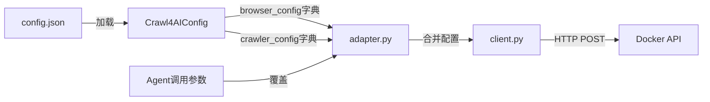

# Crawl4AI 连接器开发与使用指南 🚀

## 1. 概述 📚

Crawl4AI 连接器是一个基于 HTTP 的网络爬虫工具，它通过与 Crawl4AI Docker 服务交互，为 AI 代理提供高质量的网页内容提取功能。该连接器专为 LLM（大型语言模型）应用优化，能够将网页内容转换为干净、结构化的 Markdown 格式，适用于 RAG（检索增强生成）和 AI 代理应用。

### 核心特性 ✨
- **异步 HTTP 客户端**：基于 httpx 构建，支持连接池和重试机制
- **灵活配置**：通过 JSON 配置文件和环境变量管理参数
- **流式处理**：支持同步和流式爬取两种模式
- **错误处理**：完善的异常处理和重试策略
- **AI 代理集成**：与 LangChain 工具系统完美集成

## 2. 架构设计 🏗️

### 2.1 文件结构
```
src/tools/connector/crawl4ai/
├── __init__.py           # 工具初始化和注册
├── adapter.py           # LangChain 工具适配器
├── client.py            # HTTP 客户端实现
├── config.py            # 配置管理
├── errors.py            # 异常定义
└── utils.py (可选)      # 辅助函数
```

### 2.2 模块职责

#### 2.2.1 配置模块 (`config.py`)
- 从 JSON 配置文件加载基础设置（基础 URL、超时时间、认证令牌）
- 支持环境变量覆盖（`CRAWL4AI_BASE_URL`、`CRAWL4AI_TIMEOUT`、`CRAWL4AI_TOKEN`）
- 加载 30 多个 Crawl4AI 专用参数，包括内容过滤、页面加载和性能设置
- 提供默认值回退机制

#### 2.2.2 客户端模块 (`client.py`)
- 基于 `httpx.AsyncClient` 的异步 HTTP 封装
- 设置 `trust_env=False` 避免代理干扰
- 实现重试和退避策略以处理临时故障
- 提供 `health_check()`、`get_schema()`、`crawl()`（同步）、`crawl_stream()`（NDJSON）方法
- 映射 HTTP/网络错误到连接器异常以提供更清晰的代理消息

#### 2.2.3 适配器模块 (`adapter.py`)
- 定义 LangChain `BaseTool` 子类（`Crawl4AICrawlTool`、`Crawl4AIStreamTool`）
- 验证综合输入（30 多个参数）并委托给客户端
- 返回标准化的字典响应（Markdown、元数据、可选的 Base64 编码二进制负载）
- 支持运行时参数覆盖，优先于配置默认值

#### 2.2.4 异常模块 (`errors.py`)
- 提供 `Crawl4AIConnectorError` 基异常类
- 定义 `Crawl4AIHTTPError` 用于 HTTP 相关错误

## 3. API 接口 🌐

### 3.1 HTTP API 端点

Crawl4AI Docker 服务提供以下 REST 端点：

#### 已实现端点

| 端点 | 方法 | 用途 | 状态 |
|------|------|------|------|
| `/health` | GET | 服务健康检查 | ✅ 已实现 |
| `/schema` | GET | 获取配置 Schema | ✅ 已实现 |
| `/crawl` | POST | 同步爬取 | ✅ 已实现 |
| `/crawl/stream` | POST | 流式爬取(NDJSON) | ✅ 已实现 |

**`/crawl` 请求格式:**
```json
{
  "urls": ["https://example.com"],
  "browser_config": {
    "viewport_width": 1920,
    "headless": true
  },
  "crawler_config": {
    "word_count_threshold": 200,
    "verbose": true
  }
}
```

#### 未来可扩展端点

| 端点 | 用途 | 状态 |
|------|------|------|
| `/screenshot` | 全页截图(直接保存文件) | ❌ 未实现 |
| `/pdf` | PDF导出(直接保存文件) | ❌ 未实现 |
| `/execute_js` | 运行JavaScript | ❌ 未实现 |
| `/html` | 预处理HTML提取 | ❌ 未实现 |
| `/metrics` | Prometheus指标 | ❌ 未实现 |

**说明:**
- `/crawl` 端点中设置 `screenshot: true` 或 `pdf: true` 会返回 base64 编码数据
- 专用端点 `/screenshot` 和 `/pdf` 可直接保存文件,提供更细粒度控制

### 3.2 Python API

#### 3.2.1 Crawl4AICrawlTool

- **工具名称**: `crawl4ai_crawl`
- **描述**: 同步爬取网页并返回结构化 Markdown 内容

**参数结构 (简化后):**
```python
class Crawl4AICrawlInput(BaseModel):
    urls: List[str]  # 要爬取的URL列表

    # 配置字典 (基于 Crawl4AI SDK 配置类)
    browser_config: Optional[Dict]  # 浏览器配置 (BrowserConfig)
    crawler_config: Optional[Dict]  # 爬虫配置 (CrawlerRunConfig)

    # 预留配置字典 (未来扩展)
    http_config: Optional[Dict]
    geolocation_config: Optional[Dict]
    proxy_config: Optional[Dict]
    # ... 其他预留配置
```

**参数说明:**
- `browser_config`: 控制浏览器行为的配置字典
  - 示例: `{"viewport_width": 1920, "headless": true, "enable_stealth": true}`
  - 详见 [BrowserConfig 参数表](#browser-config-参数)

- `crawler_config`: 控制爬取行为的配置字典
  - 示例: `{"word_count_threshold": 200, "verbose": true, "prefer_fit_markdown": true}`
  - 详见 [CrawlerRunConfig 参数表](#crawler-config-参数)

**完整参数列表:**
- 参考 `config/connector/crawl4ai/README.md` 获取所有可用参数
- 参考 `config/connector/crawl4ai/config_example.json` 获取完整配置示例

## 4. 配置系统 ⚙️

### 4.1 配置文件结构

Crawl4AI 连接器支持分层配置系统，优先级从高到低：

1. **API 调用参数**：运行时传入的参数(最高优先级)
2. **JSON 配置文件**：`config/connector/crawl4ai/config.json`
3. **环境变量**：以 `CRAWL4AI_` 开头的环境变量
4. **默认值**：代码中的默认配置(最低优先级)

### 4.2 参数传递流程



**流程说明:**
1. config.json 中的配置被加载到 Crawl4AIConfig 对象
2. adapter 获取配置字典并复制为基础配置
3. Agent 调用时传递的参数会覆盖基础配置
4. 最终配置通过 client 发送到 Docker API

### 4.3 JSON 配置示例

```json
{
  "default": {
    "base_url": "http://localhost:11235",
    "timeout": 60,
    "stream_timeout": 120,
    "retry_attempts": 2,
    "token": null
  },
  "browser": {
    "browser_type": "chromium",
    "headless": true,
    "viewport_width": 1080,
    "viewport_height": 600,
    "user_agent": "Mozilla/5.0...",
    "ignore_https_errors": true,
    "enable_stealth": false
  },
  "crawler": {
    "word_count_threshold": 200,
    "only_text": false,
    "excluded_tags": ["nav", "footer", "aside", "script", "style"],
    "cache_mode": "bypass",
    "wait_until": "domcontentloaded",
    "page_timeout": 60000,
    "verbose": true,
    "return_format": "markdown",
    "prefer_fit_markdown": false
  }
}
```

**完整配置示例:** 参考 `config/connector/crawl4ai/config_example.json`

### 4.4 配置参数速查表

#### Browser Config 参数

| 参数 | 类型 | 说明 | 默认值 |
|------|------|------|--------|
| `browser_type` | str | 浏览器类型 | "chromium" |
| `headless` | bool | 无头模式 | true |
| `viewport_width` | int | 视口宽度 | 1080 |
| `viewport_height` | int | 视口高度 | 600 |
| `user_agent` | str | 用户代理字符串 | Chrome UA |
| `enable_stealth` | bool | 反检测模式 | false |
| `ignore_https_errors` | bool | 忽略HTTPS错误 | true |

#### Crawler Config 参数

| 参数 | 类型 | 说明 | 默认值 |
|------|------|------|--------|
| `word_count_threshold` | int | 最小字数阈值 | 200 |
| `only_text` | bool | 仅提取文本 | false |
| `excluded_tags` | list | 排除的HTML标签 | ["nav", "footer", ...] |
| `cache_mode` | str | 缓存模式 | "bypass" |
| `wait_until` | str | 等待条件 | "domcontentloaded" |
| `page_timeout` | int | 页面超时(ms) | 60000 |
| `screenshot` | bool | 截图(base64) | false |
| `pdf` | bool | 生成PDF(base64) | false |
| `verbose` | bool | 详细日志 | true |

#### LLM 优化参数

| 参数 | 类型 | 说明 | 推荐值 |
|------|------|------|--------|
| `content_filter_type` | str | 过滤类型 | "pruning" 或 "bm25" |
| `pruning_threshold` | float | 修剪阈值 | 0.48 |
| `prefer_fit_markdown` | bool | 优先fit_markdown | true |
| `max_token_length` | int | 最大token长度 | 根据需要 |
| `user_query` | str | BM25查询词 | 相关关键词 |

**完整参数列表:** 参考 `config/connector/crawl4ai/README.md`

## 5. 错误处理 🛡️

### 5.1 异常层次结构
- `Crawl4AIConnectorError`：Crawl4AI 连接器错误的基异常
- `Crawl4AIHTTPError`：HTTP 相关错误，包含状态码

### 5.2 错误处理策略
- **超时**: `/crawl` 60秒，`/crawl/stream` 120秒；可通过环境变量配置
- **重试**: 对连接错误和 502/503 响应的有限指数退避
- **用户友好错误**: 将 HTTP 状态码映射为简洁消息（401 → 认证必需，504 → 爬虫超时等）
- **客户端初始化验证**: 确保客户端通过异步上下文管理器初始化

### 5.3 健康检查机制
连接器实现健康检查功能，验证 Crawl4AI 服务是否正常运行：

```python
async def health_check(self) -> bool:
    """检查 Crawl4AI 服务是否健康"""
    try:
        result = await self._make_request("GET", "/health")
        return result.get("status") == "ok"
    except Exception:
        return False
```

## 6. 与 AI 代理连接 🔗

### 6.1 工具注册系统
Crawl4AI 连接器通过 `ConnectorToolManager` 与 AI 代理集成：

- **工具管理**: 实现类似于 `SDKToolManager` 的 API（`get_all_tools()`、`get_tool_by_name()`、`get_tools_info()`）
- **源标记**: 应用源标记，如 `tool.metadata = {"source": "connector.crawl4ai"}` 用于下游过滤
- **CLI 集成**: 通过 `:connector status` 和 `:connector tools` 命令提供状态和工具列表信息

### 6.2 代理集成实现
1. `src/tools/__init__.py` 导入 `ConnectorToolManager`，与 SDK/MCP 并列
2. 修改代理的 `_load_tools()` 方法（`OpenAIAgent`、`OllamaAgent`、`ZhipuAgent` 等）在 SDK 和 MCP 工具后附加连接器工具
3. 确保工具元数据包含 `source="connector.crawl4ai"` 用于日志/分析
4. 在代理文档中提供简短的提示指导：何时调用 Crawl4AI（实时网站内容、截图、PDF、JS 执行）

### 6.3 CLI 集成
- 引入 `src/components/connector_control.py`，仿照 `mcp_control.py` 但简化：
  - `connector_status(verbose: bool = False)` → 运行健康检查，返回工具计数和基础 URL
  - `connector_tools(json_flag: bool = False)` → 列出注册的连接器工具，包含名称和描述
- 扩展 CLI 解析器（如 `src/components/cli.py`）添加 `:connector status` 和 `:connector tools` 命令
- 命令依赖 `ConnectorToolManager` 获取数据；健康检查访问 `/health` 并报告通过/失败

## 7. 使用方法 💡

### 7.1 Agent 自动调用 (推荐)

**最简单的使用方式是让 Agent 自动识别并调用工具:**

```python
# Agent 会根据用户请求自动调用 crawl4ai_crawl 工具
user: "请帮我爬取 https://example.com 的内容"

# Agent 内部流程:
# 1. 识别需要使用 crawl4ai_crawl 工具
# 2. 构造参数: {"urls": ["https://example.com"]}
# 3. 自动使用配置文件中的默认参数
# 4. 返回处理后的 Markdown 内容
```

### 7.2 程序化调用

**直接调用工具:**

```python
from src.tools.connector.crawl4ai import get_tools

# 获取 Crawl4AI 工具
tools = get_tools()
crawl_tool = tools[0]  # Crawl4AICrawlTool

# 基本使用 - 使用配置文件参数
result = await crawl_tool._arun(
    urls=["https://example.com"]
)

# 自定义参数 - 覆盖配置文件
result = await crawl_tool._arun(
    urls=["https://example.com"],
    crawler_config={
        "word_count_threshold": 100,
        "verbose": False,
        "prefer_fit_markdown": True
    }
)

# 完整自定义 - 浏览器和爬虫配置
result = await crawl_tool._arun(
    urls=["https://example.com"],
    browser_config={
        "viewport_width": 1920,
        "viewport_height": 1080,
        "enable_stealth": True
    },
    crawler_config={
        "only_text": True,
        "content_filter_type": "pruning",
        "pruning_threshold": 0.5
    }
)
```

### 7.3 配置文件使用

**1. 复制配置示例:**
```bash
cp config/connector/crawl4ai/config_example.json config/connector/crawl4ai/config.json
```

**2. 编辑配置文件:**
```json
{
  "default": {
    "base_url": "http://localhost:11235"
  },
  "browser": {
    "viewport_width": 1920,
    "enable_stealth": true
  },
  "crawler": {
    "word_count_threshold": 200,
    "prefer_fit_markdown": true
  }
}
```

**3. Agent 自动使用配置:**
工具调用时会自动使用 config.json 中的默认配置

### 7.4 LLM 优化用法示例

#### 场景1: 使用 Pruning 过滤器获取高质量内容
```python
result = await crawl_tool._arun(
    urls=["https://example.com/article"],
    crawler_config={
        "content_filter_type": "pruning",
        "pruning_threshold": 0.48,
        "pruning_threshold_type": "fixed",
        "min_word_threshold": 30,
        "prefer_fit_markdown": True,
        "extract_main_content": True,
        "only_text": True
    }
)
```

#### 场景2: 使用 BM25 过滤器获取查询相关内容
```python
result = await crawl_tool._arun(
    urls=["https://example.com/search-results"],
    crawler_config={
        "content_filter_type": "bm25",
        "user_query": "artificial intelligence machine learning",
        "bm25_threshold": 1.0,
        "max_token_length": 50000,
        "prefer_fit_markdown": True
    }
)
```

#### 场景3: 配置文件中设置 LLM 优化参数

**编辑 config.json:**
```json
{
  "crawler": {
    "content_filter_type": "pruning",
    "pruning_threshold": 0.48,
    "prefer_fit_markdown": true,
    "extract_main_content": true,
    "max_token_length": 100000,
    "only_text": true,
    "excluded_tags": ["nav", "footer", "aside", "script", "style", "header"],
    "remove_overlay_elements": true,
    "exclude_all_images": true
  }
}
```

**Agent 调用时自动使用:**
```python
# 使用配置文件中的 LLM 优化设置
result = await crawl_tool._arun(urls=["https://example.com"])
```

### 7.5 环境变量配置

可以通过环境变量覆盖配置文件:

```bash
export CRAWL4AI_BASE_URL="http://localhost:11235"
export CRAWL4AI_TIMEOUT="60"
export CRAWL4AI_STREAM_TIMEOUT="120"
export CRAWL4AI_TOKEN="your-token"
export CRAWL4AI_RETRY_ATTEMPTS="2"
```

## 8. 最佳实践 🎯

### 8.1 LLM 友好内容提取

#### 基础优化
- 通过 `only_text: true` 过滤获取干净的文本内容
- 通过 `excluded_tags` 过滤元素，排除导航、广告和非内容元素
- 通过 `java_script_enabled: true` 启用 JavaScript 支持以加载动态内容
- 通过 `wait_for` 设置等待条件，确保内容在提取前完全加载
- 通过 `scan_full_page: true` 支持单页应用程序的全页滚动

#### 高级 LLM 优化
- **智能内容过滤**: 使用 `content_filter_type: "pruning"` 自动移除低质量内容
- **内容质量控制**: 设置 `pruning_threshold: 0.48` 保留高质量内容
- **主要内容提取**: 启用 `extract_main_content: true` 专注于核心内容
- **结构化输出**: 设置 `prefer_fit_markdown: true` 获取过滤后的结构化内容
- **Token 控制**: 配置 `max_token_length` 限制内容长度，避免超出 LLM 上下文窗口
- **查询相关过滤**: 使用 `content_filter_type: "bm25"` 配合 `user_query` 获取查询相关内容

#### 内容过滤策略选择
1. **通用场景**: 使用 `pruning` 过滤器进行全面的内容清理
2. **特定查询**: 使用 `bm25` 过滤器提取与查询相关的内容
3. **高质量要求**: 结合 `pruning_threshold: 0.48` 和 `min_word_threshold: 30`
4. **Token 敏感场景**: 设置 `max_token_length` 和 `prefer_fit_markdown: true`

### 8.2 性能优化
- 合理设置超时时间，避免长时间等待
- 使用缓存模式减少重复请求
- 根据需要启用/禁用媒体处理

## 9. 测试考虑 🧪

- `ConnectorToolManager` 的单元测试，验证标记和信息摘要
- CLI 测试，覆盖成功和失败场景下的 `:connector status` 和 `:connector tools` 命令输出
- 集成测试，验证正确配置加载和参数应用

## 10. 未来增强 🚀

- 可选 JWT 流程（`POST /token` 然后 Bearer 头），一旦启用安全功能
- 复杂提取策略的高级预设（AI 辅助、余弦过滤、JS 任务）
- 大型资产的文件持久化钩子（截图/PDF），如果代理需要文件系统工件
- 当需要更高可靠性或长时间运行任务时，使用异步 `/crawl/job` 轮询工具

---

本指南记录了已实现的连接器系统，提供了用于优化 LLM 友好内容提取的全面配置选项。